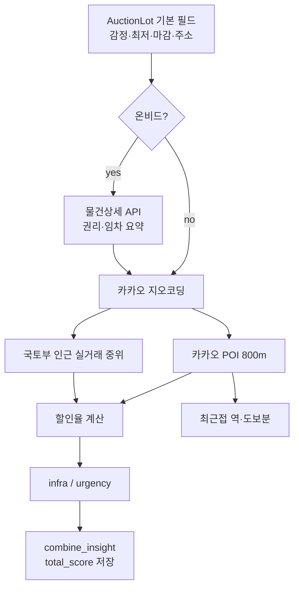

---
tags:
  - map-estate
  - auction-insight
  - enrich
  - 스크리닝
aliases:
  - enrich
  - 정보 끌어오기
created: 2026-07-23
---

# 데이터 유입 파이프라인 (enrich)

← [[00-스크리닝-점수-MOC|목차]]

물건 한 건을 “정보를 끌어올 때” 순서는 대략 아래와 같습니다.

## 단계별 산출물

| 단계 | 함수/모듈 | DB에 남기는 것 |
|------|-----------|----------------|
| 상세 | `enrich_lot_onbid_detail` | `detail_json` 등 |
| 좌표 | `ensure_lot_coords` | `lat`, `lng` |
| POI | `get_or_fetch_pois` | `poi_cache` 행 |
| 시세 | `estimate_market_for_lot` | `market_median_manwon`, `market_sample_count`, … |
| 점수 | `discount_ratio` + `infrastructure_score` + `urgency_score` + `combine_insight` | `discount_vs_*`, `infra_score`, `urgency_score`, `total_score` |
| 역세권 표시 | subway payload | `nearest_station`, `station_walk_minutes` ≈ `거리m / 80` |

## 핵심 코드 (enrich_lot)

파일: `backend/app/services/enrich.py`

1. (옵션) 온비드 상세  
2. 좌표  
3. (옵션) POI  
4. (옵션) 시세  
5. 할인율 두 개  
6. POI 있으면 인프라 재계산, 없으면 기존 `infra_score` 유지  
7. 마감 긴급도  
8. `combine_insight` → 종합점수 저장  

## 관련 노트

- [[02-할인율]]
- [[03-인프라-POI]]
- [[04-마감-긴급도]]
- [[05-종합점수]]
